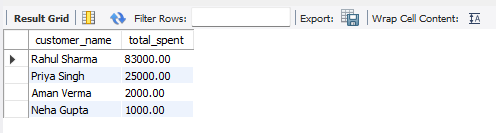
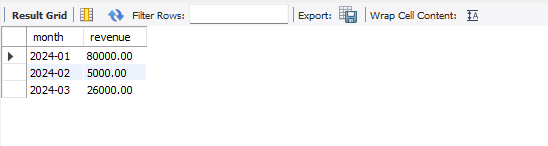
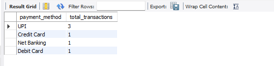
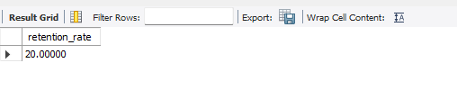

E-Commerce Customer Behavior Analysis using SQL
---


## 📖 Project Overview

This project analyzes customer purchasing behavior in an e-commerce platform using SQL. The objective is to uncover actionable insights related to customer spending, product performance, sales trends, and customer retention.

Using SQL queries, the project transforms raw transactional data into meaningful business intelligence that can support marketing, inventory, and operational decision-making.

---

## 🎯 Business Objectives

* Analyze customer purchasing patterns.
* Identify high-value customers.
* Track monthly revenue performance.
* Discover top-selling products and categories.
* Measure customer retention and repeat purchases.
* Analyze payment method preferences.

---

## 📂 Dataset

The analysis uses five relational tables:

| Table       | Description                 |
| ----------- | --------------------------- |
| Customers   | Customer information        |
| Orders      | Order transactions          |
| Order_Items | Product-level order details |
| Products    | Product catalog             |
| Payments    | Payment information         |

---

## 🛠 SQL Concepts Used

* SELECT Statements
* WHERE Clause
* GROUP BY
* ORDER BY
* Aggregate Functions
* INNER JOIN
* LEFT JOIN
* Subqueries
* Common Table Expressions (CTEs)
* Window Functions

---

## 📊 Business Questions Solved

### Customer Analysis

* Who are the top spending customers?
* Which customers place repeat orders?
* What is the customer retention rate?

### Revenue Analysis

* What are the monthly revenue trends?
* Which months generate the highest sales?
* What is the average order value?

### Product Analysis

* Which products generate the highest revenue?
* Which categories perform best?
* What are the best-selling products?

### Payment Analysis

* Which payment methods are most preferred?
* How are transactions distributed across payment channels?

---

## 📈 Project Snapshots

### Top Customers Analysis



### Monthly Revenue Analysis



### Payment Method Analysis



### Customer Retention Analysis



---

## 🔍 Key Insights

* Identified top-spending customers contributing significantly to overall revenue.
* Analyzed monthly sales trends to determine peak business periods.
* Discovered best-performing product categories and products.
* Evaluated repeat purchase behavior and customer retention patterns.
* Analyzed customer payment preferences to understand transaction behavior.

---

## 📌 Business Recommendations

* Implement loyalty programs for repeat customers.
* Promote top-performing products through targeted campaigns.
* Increase inventory during peak sales periods.
* Personalize marketing for high-value customers.
* Optimize checkout experience based on preferred payment methods.

---

## 📁 Repository Structure

```text
Ecommerce-Customer-Behavior-Analysis-SQL
│
├── data
│   ├── customers.csv
│   ├── orders.csv
│   ├── order_items.csv
│   ├── payments.csv
│   └── products.csv
│
├── sql
│   ├── create_tables.sql
│   ├── insert_data.sql
│   └── analysis_queries.sql
│
├── screenshots
│   ├── monthly_revenue.png
│   ├── payment_analysis.png
│   ├── retention_rate.png
│   └── top_customers.png
│
├── docs
│   └── Ecommerce_Customer_Behavior_SQL_Project.pdf
│
├── image.png
└── README.md
```

---

## 💼 Resume Highlights

* Analyzed customer purchasing behavior using SQL across customer, product, and transaction datasets.
* Identified top-performing products, customer segments, and revenue trends through advanced SQL queries.
* Evaluated repeat purchase patterns and customer retention metrics to support business growth strategies.
* Generated actionable insights for marketing, inventory management, and sales optimization.

---

## 🛠 Tools & Technologies

* SQL
* MySQL
* GitHub
* Excel

---

## 👨‍💻 Author

**Sourav Kumar**

Data Analyst | SQL Developer

⭐ If you found this project useful, consider giving it a star.
